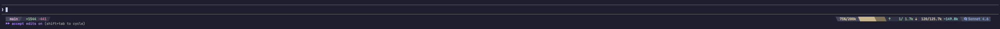

# claude-code-statusline

A Powerline-style terminal statusline for [Claude Code](https://claude.ai/code) that shows real-time session metrics: context window usage, token counts, model name, git branch state, and lines changed.



## What it shows

**Left side**
- Git branch + dirty indicator (✦) + ahead/behind counts
- Lines added / removed in the session
- ⚡ COMPACT warning when context window ≥ 85% used

**Right side**
- Context usage % and window size (e.g. `64%/200k`)
- 10-block progress bar with a slant edge at the filled/empty boundary
- Token counts: input ↑, output ↓, cache ~
- Model name

## Requirements

- [Nerd Fonts](https://www.nerdfonts.com/) patched font in your terminal
- Go 1.22+ (to build)
- Claude Code with `statusLine` support in `settings.json`

## Installation

```bash
git clone https://github.com/aaltw/claude-code-statusline.git
cd claude-code-statusline
go build -o ~/.claude/statusline-bin .
```

Then add to `~/.claude/settings.json`:

```json
{
  "statusLine": {
    "type": "command",
    "command": "STATUSLINE_THEME=slantr ~/.claude/statusline-bin"
  }
}
```

## Themes

Select a theme via the `STATUSLINE_THEME` environment variable:

| Value | Separator style |
|---|---|
| `arrow` (default) | `►` / `◄` filled triangles |
| `round` | curved half-circles |
| `slant` | `/` diagonal slant |
| `slantr` | `\` diagonal slant (reversed) |
| `flame` | flame-style |
| `plain` | `│` plain divider |

```bash
# in settings.json command:
STATUSLINE_THEME=round ~/.claude/statusline-bin
```

## Colors

Catppuccin Mocha palette. Context bar color shifts with usage:

| Usage | Color |
|---|---|
| < 70% | Green |
| 70–89% | Yellow |
| ≥ 90% | Red |

## How it works

Claude Code pipes a JSON blob to the binary on each statusline refresh. The binary renders an ANSI-colored Powerline statusline to stdout and writes two bridge files to `/tmp/` for use by other hooks:

- `claude-ctx-<session>.json` — context remaining % (used by PostToolUse hooks to warn when context is low)
- `claude-monitor-<session>.json` — full token and rate-limit metrics

Git info is cached per session for 5 seconds to avoid subprocess overhead on every render.

## Building

```bash
go build -o statusline .

# smoke test
echo '{"model":{"display_name":"Claude Sonnet 4.6"},"context_window":{"used_percentage":64,"remaining_percentage":36,"context_window_size":200000,"current_usage":{"input_tokens":1200,"output_tokens":400,"cache_read_input_tokens":300,"cache_creation_input_tokens":100},"total_input_tokens":5000,"total_output_tokens":1500},"cost":{"total_lines_added":10,"total_lines_removed":3},"session_id":"test","cwd":"."}' | STATUSLINE_THEME=slantr ./statusline
```

## Project structure

| File | Responsibility |
|---|---|
| `main.go` | Entry point — decodes input, builds segments, renders, writes bridge files |
| `input.go` | JSON input structs |
| `color.go` | `Color` type, `Palette` struct, Catppuccin Mocha palette |
| `theme.go` | `Theme` struct, predefined themes, `activeTheme()` |
| `segment.go` | `Segment` struct, `renderLeft` / `renderRight` |
| `git.go` | Git queries with 5-second file cache |
| `layout.go` | Terminal width detection, token formatting, ANSI width stripping |
| `bridge.go` | `/tmp/` bridge file writers |
